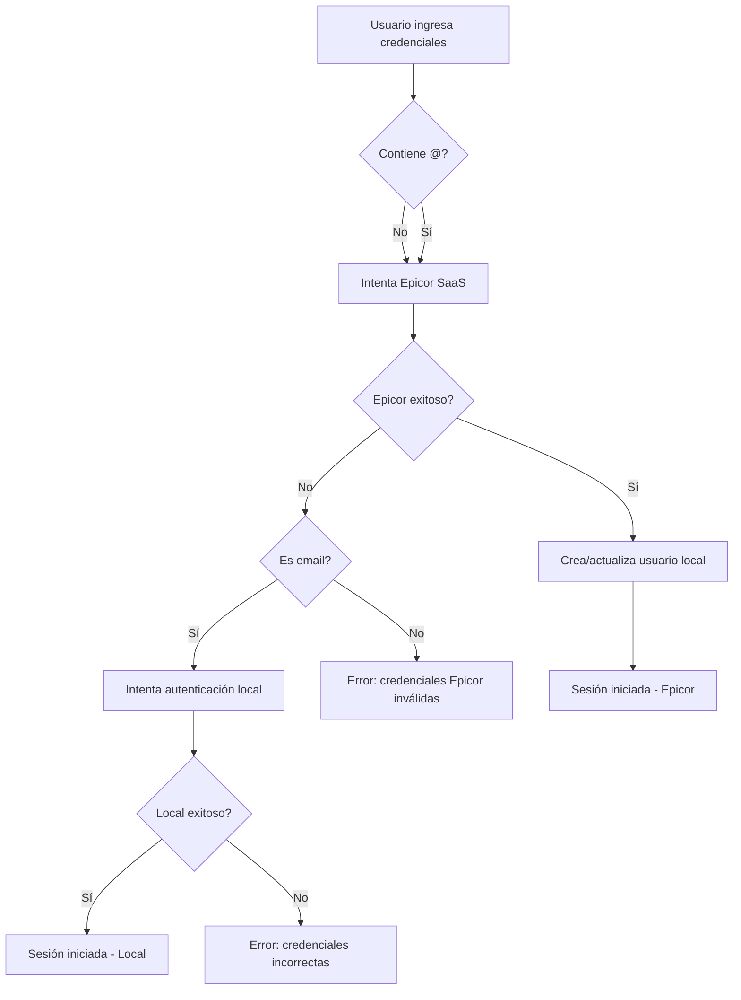

# 🔐 Autenticación Epicor SaaS - Documentación

## 📋 Resumen de Implementación

Se ha integrado exitosamente la autenticación con **Epicor SaaS** manteniendo todas las funcionalidades existentes de Google OAuth y cuentas locales.

## 🚀 Características Implementadas

### ✅ Triple Sistema de Autenticación

1. **Epicor SaaS** (Principal)
   - Usuario sin @ (ej: `jperez`)
   - Autenticación mediante Basic Authentication
   - Token de acceso almacenado en sesión
   - Información adicional del empleado (opcional)

2. **Google OAuth** (Existente)
   - Funcionalidad completamente preservada
   - Botón independiente de login
   - Registro automático de usuarios

3. **Cuentas Locales** (Existente)
   - Email con @ para cuentas registradas
   - Sistema de fallback si falla Epicor

### 🔧 Configuración Técnica

#### URLs de Epicor Configuradas:
```python
EPICOR_TOKEN_RESOURCE_URL = "https://centralusdtapp73.epicorsaas.com/SaaS5333/TokenResource.svc/"
EPICOR_TI_USEREMP_URL = "https://centralusdtapp73.epicorsaas.com/SaaS5333/api/v2/odata/SaaS5333/Erp.BO.UserFileSvc/UserFiles"
```

#### Funciones Implementadas:

1. **`authenticate_epicor(username, password)`**
   - Implementa Basic Authentication con base64
   - Envía payload JSON con credenciales
   - Maneja respuestas y errores de conexión
   - Retorna token de acceso `AccessToken`

2. **`get_epicor_user_info(username, access_token)`**
   - Obtiene información adicional del empleado
   - Usa Bearer token para autorización
   - Parámetro Chatbot en URL

### 📋 Flujo de Autenticación



### 💾 Datos de Sesión

Para usuarios autenticados con Epicor se almacena:
```python
session['usuario'] = user['usuario']
session['auth_method'] = 'epicor'
session['epicor_token'] = access_token
session['epicor_user_info'] = user_info_epicor  # Información adicional
```

### 🎨 Interfaz de Usuario

- **Campo de entrada:** Acepta tanto usuario Epicor como email local
- **Placeholder:** "Usuario Epicor o Email Local"
- **Mensaje informativo:** "🔐 Usa tu usuario Epicor (sin @) o email para cuenta local"
- **Iconos modernos:** 👤 para usuario, 🔒 para contraseña

### 🔒 Seguridad

- **Basic Authentication** con base64 encoding
- **Timeout de 10 segundos** para requests
- **Manejo robusto de errores** de conexión
- **Tokens seguros** almacenados en sesión Flask
- **Validación de respuestas** JSON y texto plano

### 🧪 Testing

Para probar la funcionalidad:

1. **Usuario Epicor:** Usa formato `usuario` (sin @)
2. **Cuenta local:** Usa formato `email@dominio.com`
3. **Google OAuth:** Botón independiente funcional

### 📝 Notas de Desarrollo

- ✅ Compatible con el formato original de la aplicación
- ✅ Preserva todas las funcionalidades existentes
- ✅ Manejo de errores detallado
- ✅ Código limpio y documentado
- ✅ Fácil mantenimiento y extensión

### 🚨 Consideraciones

- La URL de Epicor debe estar disponible y funcional
- El usuario debe tener credenciales válidas en Epicor SaaS
- La aplicación maneja timeouts y errores de conexión graciosamente
- Los tokens de Epicor se mantienen durante la sesión del usuario

---
*Implementación completada: Octubre 2025*
*Versión: 1.0*